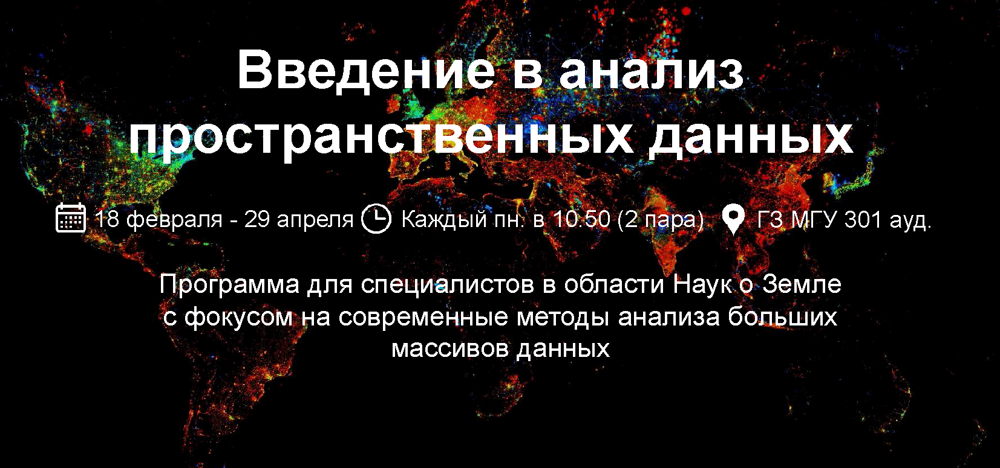

В курсе мы рассмотрим анализ данных дистанционного зондирования Земли с помощью _Google Earth Engine_

**Вы узнаете:**
- Что такое облачные геоинформационные системы
- Что такое дистанционное зондирование Земли и его виды
- Что такое машинное обучение и как можно его использовать для сегментации объектов для данных дистанционного зондирования Земли
          
**Вы научитесь:**
- Производить анализ спектральных каналов спутниковой съемки
- Находить свежие и исторические данные спутниковой съемки, с учетом облачности территории, в пределах региона исследований
- Анализировать собственные векторые наборы данных и данные спутниковой съемки
- Использовать алгоритм на основе машинного обучения для автоматической сегментации и классификации объектов на спутниковых снимках